# Installation Setup for Mac:
1. Install Homebrew following the steps on: 
https://www.geeksforgeeks.org/python/how-to-install-python-on-mac

2. Install Python 3.9 using the command: <br>

```bash
brew install python@3.9
```
3. Download the ZIP file [(1) Apple Silicon Mac (2) Intel Mac] from the following link:
[Download for Apple Silicon MAC](https://drive.google.com/file/d/1UF2406CKWcCORiewoVUDPUVne11gyadi/view?usp=sharing) 
[Download for Intel MAC](https://drive.google.com/file/d/1g1SJnqOx0kmNbp-u2eZ3NiMFceltaEV_/view?usp=drive_link) 

4. Extract the files
5. Go to the extracted folder
<figure align="center">
  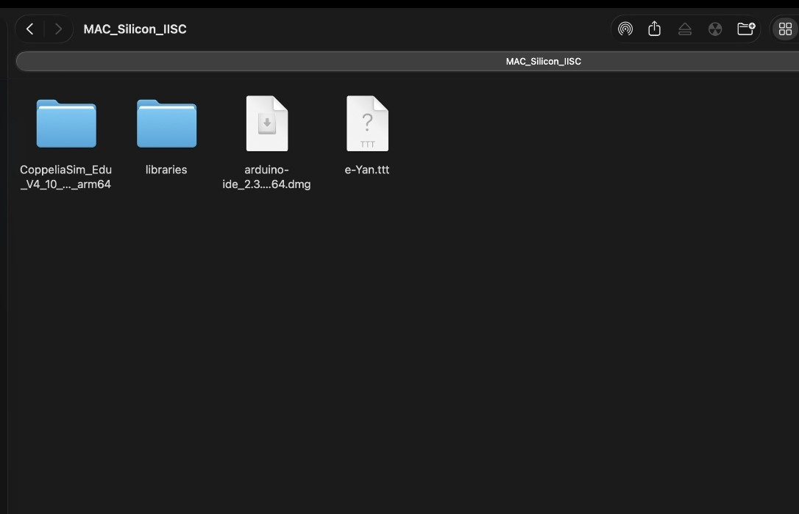
</figure>

6. Click on the arduino dmg file and drag the arduino icon to Applications
<figure align="center">
  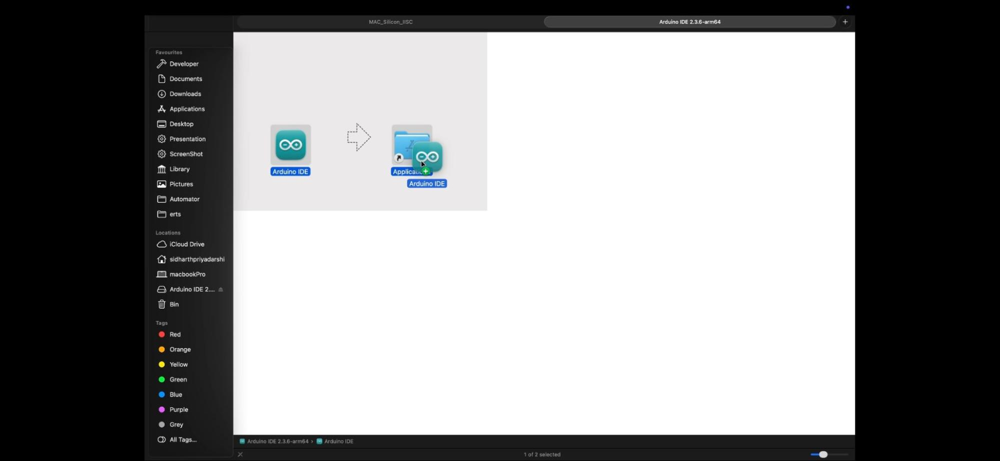
</figure>

7. After it is done go to the libraries folder inside the extracted folder and copy everything.

<figure align="center">
  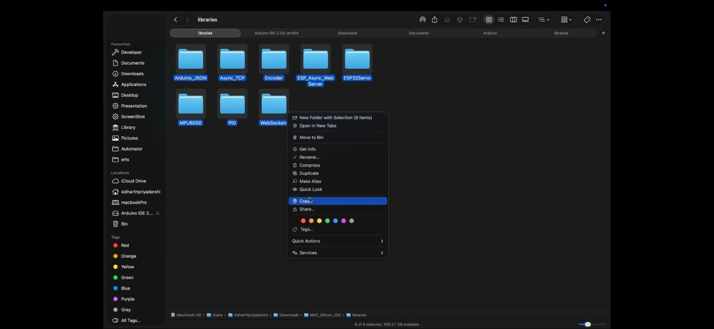
</figure>

8. Now go to Documents folder then Arduino folder and then libraries folder (**Note: If you can’t find “libraries” folder create a folder named libraries inside Arduino folder**) and paste it

<figure align="center">
  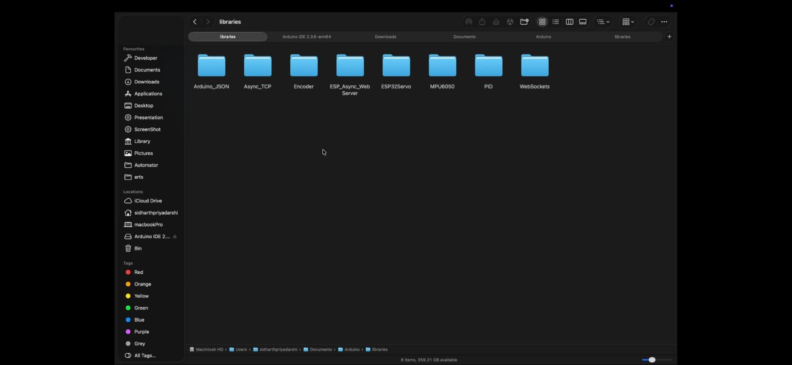
</figure>

9. Now open Arduino IDE app and go to File then Examples and see if names such as MPU6050, PID, etc appears

<figure align="center">
  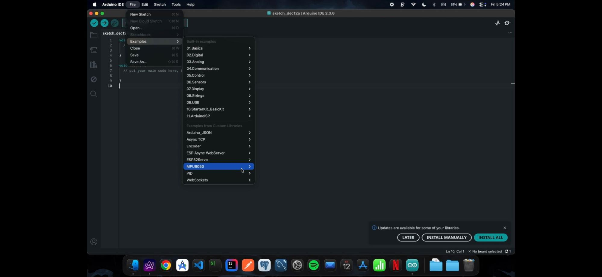
</figure>

10. If it appears then the Arduino installation was successful.
11. Now go back to the extracted folder and open a terminal there and type the following:

```bash
python3.9 -m venv venv
source ./venv/bin/activate

```

Install the mathplotlib library

```bash
pip install numpy matplotlib pyzmq cbor2
```
<figure align="center">
  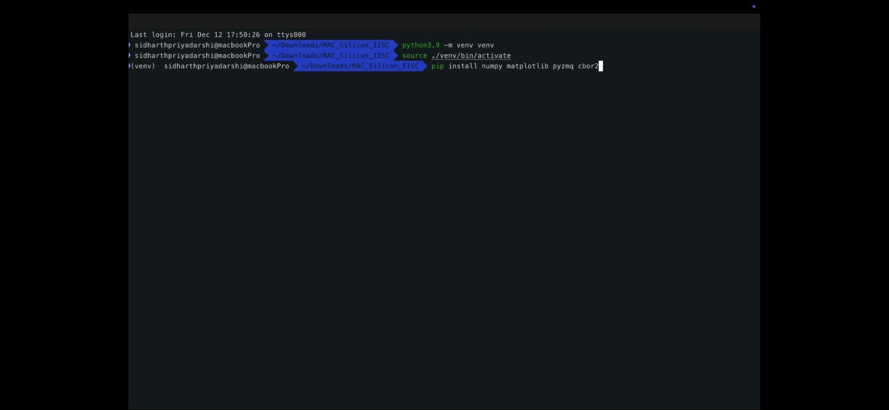
</figure>

12. After it’s done type:
***which python3.9*** <br>
and copy the path.

<figure align="center">
  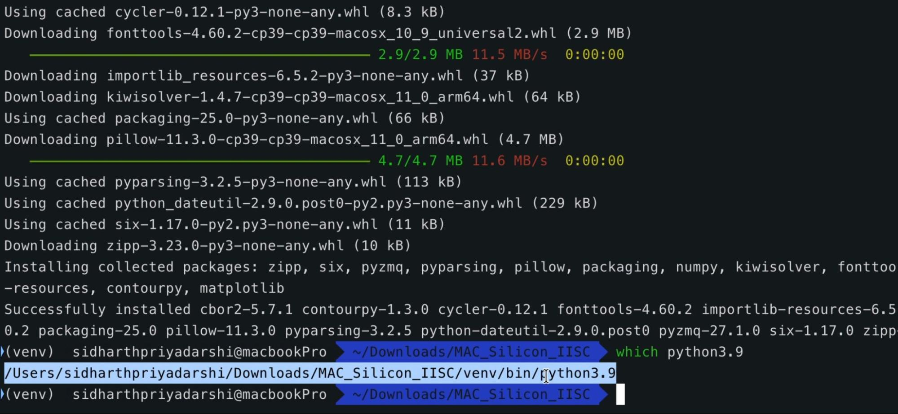
</figure>

13. Now open CoppeliaSim which will be inside the coppeliasim folder inside the extracted folder and type **sim.getStringParam(sim.stringparam_usersettingsdir)** in the Commander input field located in the status bar at the bottom of the application window.

<figure align="center">
  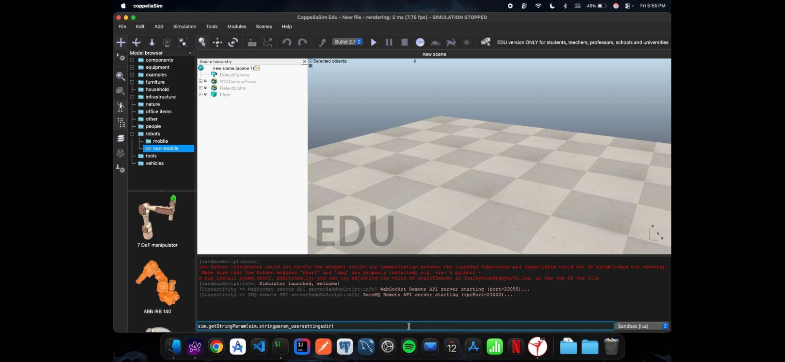
</figure>

which will output the location of usrset.txt file in the terminal

<figure align="center">
  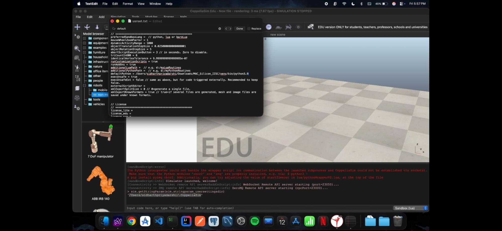
</figure>

14. Now go to the location, the folders will be hidden, to unhide it do ```“Command (⌘) + Shift (⇧) + Period (.)”```. Open usrset.txt file and paste the path of python in the line ```“defaultPython = …”```.

<figure align="center">
  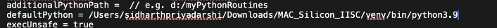
</figure>

15. Restart CoppeliaSim again and select Python.

<figure align="center">
  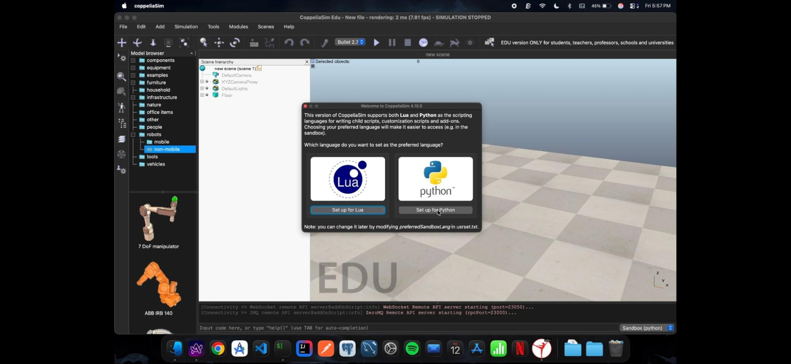
</figure>

16. Setup for CoppeliaSim should be done

After Arduino, CoppeliaSim will start installing, keep the default settings and keep pressing Next

<figure align="center">
  
</figure>

<figure align="center">
  
</figure>

<figure align="center">
  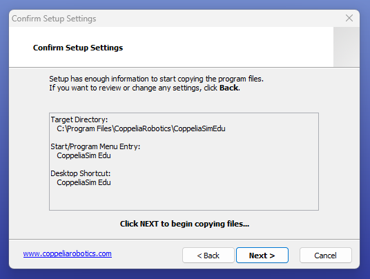
</figure>

<figure align="center">
  
</figure>

<figure align="center">
  
</figure>

**(Note: If the installation seems to get stuck press Enter)**
17. After this you can close the windows by pressing ```Enter```.The setup will be completed successfully.
18. After installation steps: Steps to setup Arduino IDE after installation: To install the ESP32 board in your Arduino IDE, follow these next instructions

<figure align="center">
  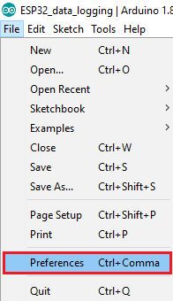
</figure>

19. Enter the following into the “Additional Board Manager URLs” field: ```https://raw.githubusercontent.com/espressif/arduino-esp32/gh-pages/package_esp32_index.json```
Then, click the “OK” button:

<figure align="center">
  
</figure>

***Note:*** If you already have the ESP8266 boards URL added, you can separate multiple URLs with a comma as shown below:
```https://raw.githubusercontent.com/espressif/arduino-esp32/gh-pages/package_esp32_index.json, http://arduino.esp8266.com/stable/package_esp8266com_index.json```

Open the Boards Manager. Go to Tools > Board > Boards Manager

<figure align="center">
  
</figure>

Search for ESP32 and press install button for the “ESP32 by Espressif Systems“
<figure align="center">
  
</figure>

That’s it. It should be installed after a few seconds.