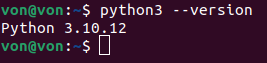

# Installation Setup for Ubuntu 22.04: 

1. **Python Installation :** 
    -  Follow the below instructions.
    ```
    sudo apt update
    sudo apt install python3
    ```
    - After installation, verify the version:
    ```
    python3 --version
    ```
    After the installation, verify the version using:
    <div style="text-align: center;">
    
    </div>

2. **Download the file**  
   Download the ZIP file **`Ubuntu_22.04_IISC.zip`** from the following link:  
   [Download from Google Drive](https://drive.google.com/file/d/1c6cSPrxxwglufFdNAKFxofoG06r23I0x/view)

3. **Extract the ZIP file**  
   Once the download is complete, right-click on the ZIP file and select **“Extract Here”** to unzip its contents.
    
    <div style="text-align: center;">
    
    </div>

4.  **Run the setup file** <br>
    Go to the Directory “IISC_files” and run the command 
    ```
      ./setup_IISC
    ```
    The setup will be completed successfully


# Installation Setup for Ubuntu 24.04: 

1. **Download the file**  
   Download the ZIP file **`Ubuntu_24.04_IISC.zip`** from the following link:  
   [Download from Google Drive](https://drive.google.com/file/d/14HhkPPxxDFWA387KHhmYASC7kLebyea1/view?usp=drive_link)

2. Follow the same steps as For Ubuntu 22.04


Ensure Python 3 and pip are installed<br>
Install the required Python packages:
```bash

python3 -m pip install numpy matplotlib pyzmq cbor2

```