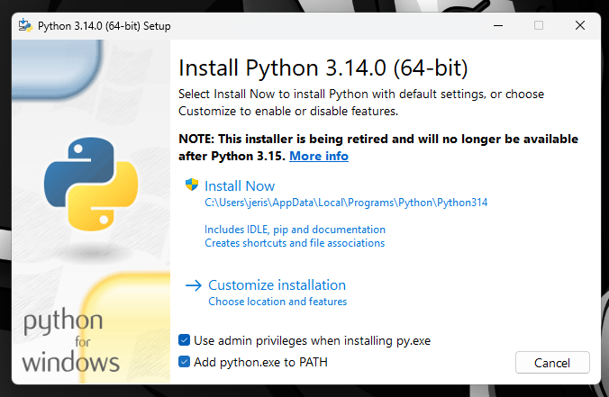
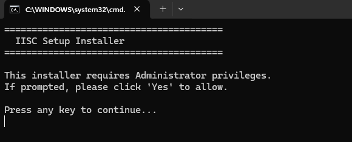
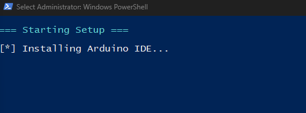
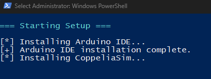
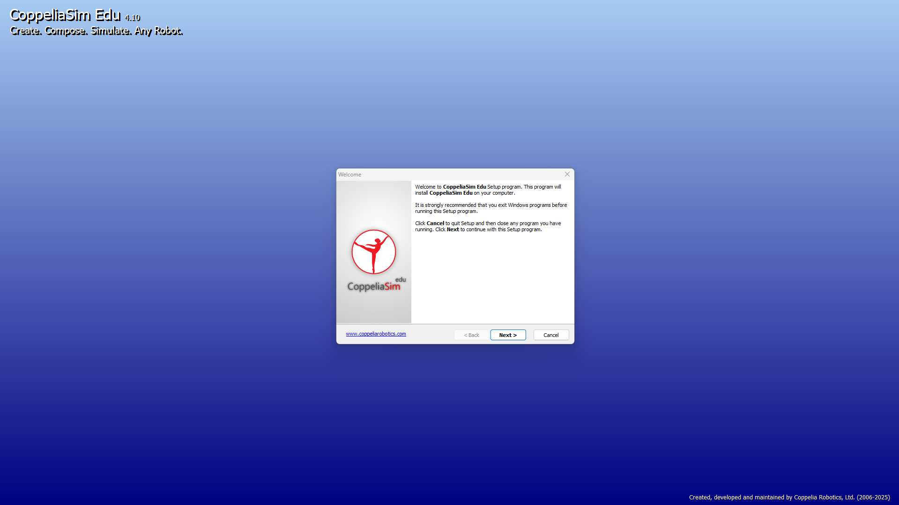
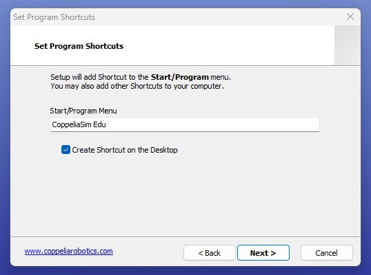
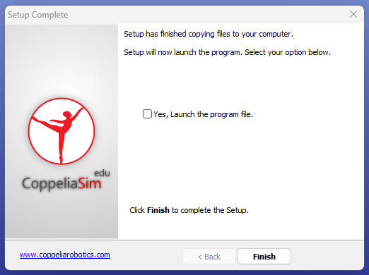
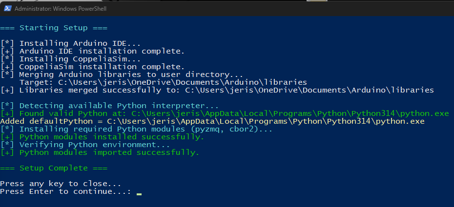
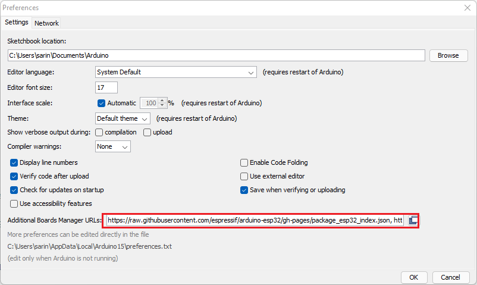
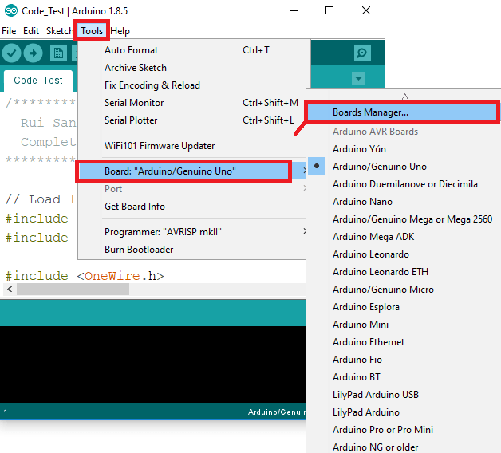

# Installation Setup for Windows: 

1. Download the ZIP file **`Windows.zip`** from the following link:  
   [Download from Google Drive](https://drive.google.com/file/d/1z58tdSOJr9C6ifRKzQakz-szIe9rr4g0/view)

2. Extract the files by Right clicking and choosing "Extract All"

    <div style="text-align: center;">
    
    </div>

3. Go to the directory and select the python installer based on whether your system is 32 bit or 64 bit  <br>
    - **Python-3.14.0** - for 32 bit
    - **Python-3.14.0-amd64** - for 64 bit<br>
    Tick “Add python.exe to PATH” and press Install Now.

    <div style="text-align: center;">
    
    </div>

4. Go to the Directory and double click on the file “setup_launcher.bat”.The below window will pop up, just press Enter.

    <div style="text-align: center;">
    
    </div>

    -  On pressing Enter, the setup will begin

    <div style="text-align: center;">
    
    </div>

***(Note: If the installation seems to get stuck press Enter)***

<div style="text-align: center;">

</div>

***(Note: If the installation seems to get stuck press Enter)***
 
After Arduino, CoppeliaSim will start installing, keep the default settings and keep pressing Next

<div style="text-align: center;">

</div>

<div style="text-align: center;">

</div>

<div style="text-align: center;">

</div>

- After installation untick the option to stop it from launching CoppeliaSim and press Finish

<div style="text-align: center;">

</div>

<div style="text-align: center;">

</div>

***(Note: If the installation seems to get stuck press Enter)***

- After this you can close the windows by pressing Enter
- The setup will be completed successfully.

5. After installation steps:
    Steps to setup Arduino IDE after installation:
    To install the ESP32 board in your Arduino IDE, follow these next instructions

    1. In your Arduino IDE, go to File> Preferences

    <div style="text-align: center;">
    
    </div>

    2. Enter the following into the “Additional Board Manager URLs” field:
```https://raw.githubusercontent.com/espressif/arduino-esp32/gh-pages/package_esp32_index.json```
    - Then, click the “OK” button:

<div style="text-align: center;">

</div>

>**Note:** If you already have the ESP8266 boards URL added, you can separate multiple URLs with a comma as shown below:

```text
https://raw.githubusercontent.com/espressif/arduino-esp32/gh-pages/package_esp32_index.json, http://arduino.esp8266.com/stable/package_esp8266com_index.json
```

Open the Boards Manager. Go to Tools > Board > Boards Manager

<div style="text-align: center;">

</div>

Search for ESP32 and press install button for the ***“ESP32 by Espressif Systems“***:

<div style="text-align: center;">

</div>

That’s it. It should be installed after a few seconds.

<div style="text-align: center;">

</div>

Ensure Python 3 and pip are installed<br>
Open Command Prompt or PowerShell 

```bash
python -m pip install numpy matplotlib pyzmq cbor2
```
To verify successful installation, run:

```bash
python -c "import numpy, matplotlib, zmq, cbor2; print('All dependencies installed successfully')"

```